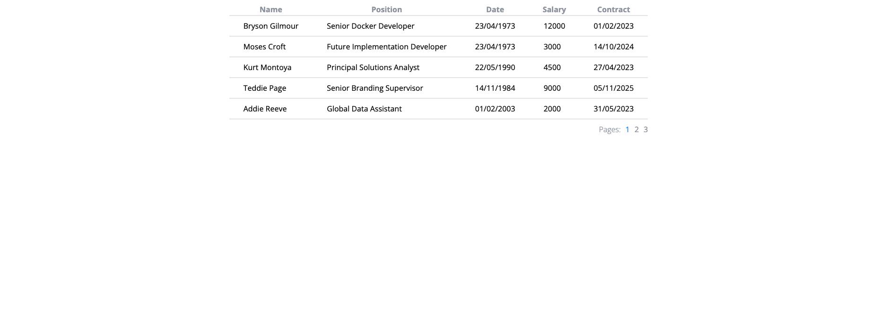
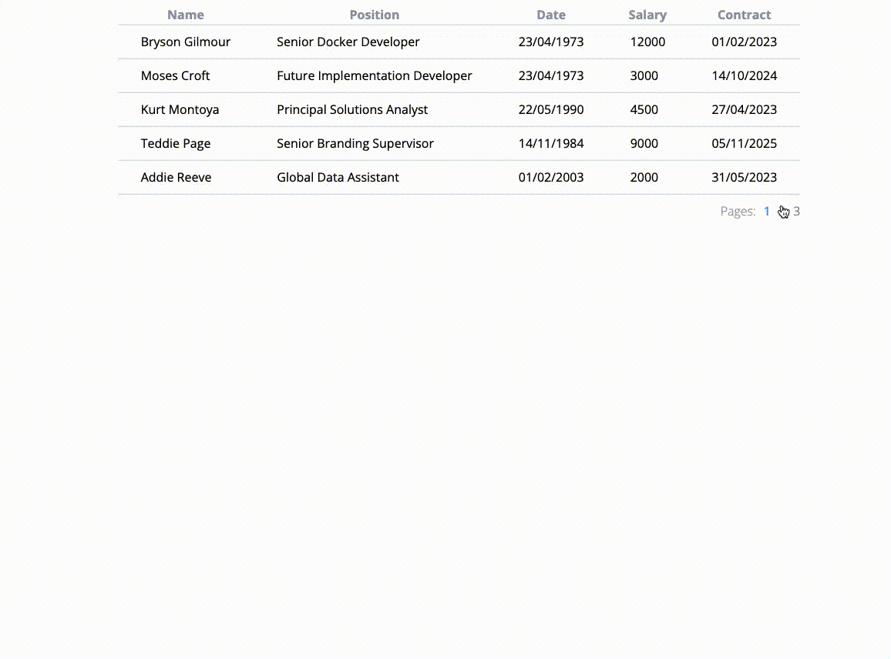

# Zadanie rekrutacyjne

## Opis

Projekt jest podzielony na dwie części (fronted i backend).

Do uruchomienia projektu potrzeba wykonać polecenie w konsoli:
``` ./start.sh ```.


Pamiętaj o zainstalowaniu zależności przed pierwszym uruchomieniem.

W folderze `backend` znajduje się prosta aplikacja obsługująca requesty dla frontendu. Nie trzeba nic tam zmieniać.

Twoje zadanie będzie polegać na dopisaniu funkcjonalności do aplikacji znajdującej się w katalogu `frontend`.

## Zadanie

1. Twoim zadaniem jest dopisać brakujące funkcjonalności, tak aby aplikacja wyświetliła w tablicy wszystkich pracowników wraz z informacjami o ich zatrudnieniu


Do pobrania tych informacji z backendu musisz wykonać request na dwa endpointy:
- ```/employess```
- ```/contracts```

Pobierz dane z tych endpointów i napisz kod aplikacji tak, aby była ona zbliżona do tego, co widać na screenshotcie powyżej.

2. Do tablicy dodaj paginacje. 
Ustaw wielkość strony na 5 elementów.


   
3. Kliknięcie danego pracownika powinno przenieść użytkownika aplikacji na osobną stronę wyświetlającą dodatkowe informacje o pracowniku
Potrzebne endpointy
- ```/employess/:id```
- ```/contracts/:id```


4. Sformatuj daty tak, aby wygodnie można było je czytać.


5. Zadbaj o to, aby na czas ładowania danych pokazał się spinner

   

6. Zadbaj o wygląd strony, akceptowalne minimum to wierne odwzorowanie wyglądu ze screenshotów.
Postaraj się dostosować do istniejących już styli i konwencji ich pisania. 
   
----

Dodatkowy filmik z działania aplikacji:



---- 

Na co zwracamy uwagę:
1. Czysty kod, uporządkowana struktura.
2. Reużywalność kodu. 
3. BEM w stylowaniu.
4. Optymalne przetwarzanie danych.
 
----

Gotową aplikacje spakuj do archiwum (.zip) i prześlij do martyna.iwat@senti1.com :) 
